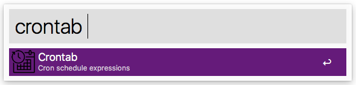

# JCID\Crontab

An Alfred workflow to simply explained the cron schedule expressions.

**Note**: You will need the Alfred [Powerpack](https://www.alfredapp.com/powerpack/) to use this workflow - which is commercial software. Check out the [Alfred app](https://www.alfredapp.com/) website.

## Usage

The keyword to trigger the search in Alfred is `crontab` by default.

### Examples

|Search|Alfred opens|
| ------------- | ------------- |
|`crontab * * * * *`|[At every minute](https://crontab.guru/#*_*_*_*_*)|
|`crontab 5 0 * 8 *`|[At 00:05 in August](https://crontab.guru/#5_0_*_8_*)|
|`crontab 15 14 1 * *`|[At 14:15 on day-of-month 1](https://crontab.guru/#15_14_1_*_*)|

**Note**: Spaces will be converted to underscores `_`.

## Download

Download the Alfred workflow via the URL

- http://alfred-workflow.jcid.nl/crontab

## License

This is licensed under [MIT License](LICENSE).
